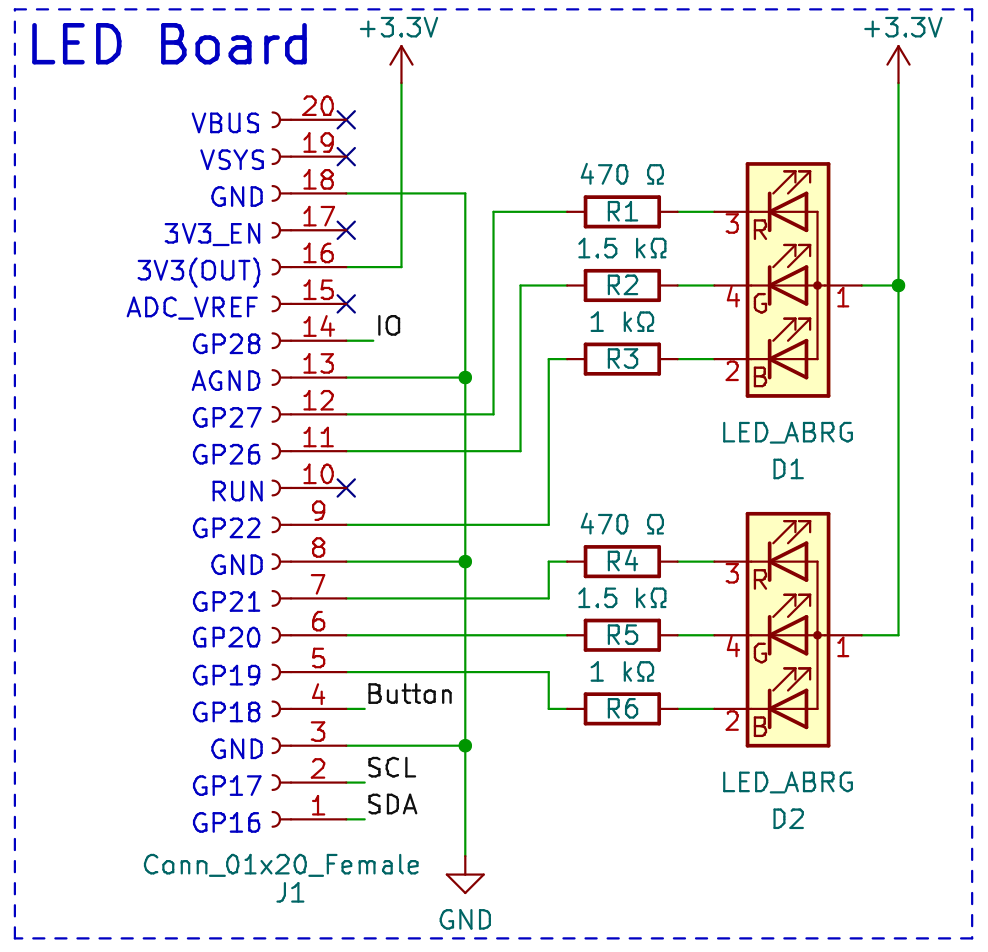

Pico Pupil Project
==================

This repo contains a small and simple software template to use with micropython on the Raspberry Pi Pico in combination with the `pico rgb led board <https://github.com/emtpb/pico-hw-rgb>`_.

Led mapping
-----------

The leds and gpios are mapped as follows:

- D1 red mapped to GPIO27
- D1 green mapped to GPIO26
- D1 blue mapped to GPIO22

- D2 red mapped to GPIO21
- D2 green mapped to GPIO20
- D2 blue mapped to GPIO19

The button is mapped to GPIO18.

Special thanks to Karl Dören for his work!
